<p align="center">
  <picture>
    <source media="(prefers-color-scheme: dark)" srcset="assets/logo-dark.png">
    
  </picture>
</p>

# cursed

[](https://www.npmjs.com/package/cursed)
[](LICENSE)
[](https://github.com/roiperlman/cursed/actions/workflows/ci.yml)
[](https://github.com/roiperlman/cursed/stargazers)

> Multi-model code review for Claude Code — route one slash command to GPT, Gemini, Grok, and more, then let Claude synthesize the panel.

<p align="center">
  
</p>

## Why this exists

Adversarial reviewers from different providers catch different bugs. Convergence is signal; divergence is noise; both are useful. `cursed` ships four slash commands — `review`, `plan-review`, `delegate`, `advise` — and routes them through pluggable CLI adapters (Cursor, Codex, Gemini CLI) so parent Claude can synthesize the result.

## Install

```
/plugin marketplace add roiperlman/cursed
/plugin install cursed@cursed
```

Restart Claude Code, then run `/cursed:setup` to configure adapters. The MCP server ships pre-bundled — no `npm install` needed.

## What it does

Four commands, each with a baked-in stance:

| Command | Default mode | Purpose |
|---|---|---|
| `/cursed:review` | 3-model panel | Adversarial review of a diff. Convergence = real issue; divergence = noise. |
| `/cursed:plan-review` | solo (panel-capable) | Verify a written plan against the actual code it claims to modify. |
| `/cursed:delegate` | solo | Hand a scoped task to a non-Claude model. Writes to your tree, or to an isolated worktree. |
| `/cursed:advise` | solo | Ask a non-Claude advisor for decisive guidance at a decision point. |

Plus `/cursed:setup` — an interactive configurator: it probes your installed CLIs, then walks you through adapters, default panel tier, model filters, and timeouts, and writes `config.toml` for you.

## Prerequisites

- Node.js 20 or later
- Claude Code
- **At least one** non-Claude CLI, installed and authenticated:
  - **Cursor CLI** (`cursor-agent`) — [install](https://cursor.com/docs/cli/headless); set `CURSOR_API_KEY` or run `cursor login`. Routes to GPT, Gemini, Grok, and more.
  - **Codex CLI** (`codex`) — [install](https://openai.com/codex); set `OPENAI_API_KEY` or run `codex login`. Routes to OpenAI models.
  - **Gemini CLI** (`gemini`) — [install](https://github.com/google-gemini/gemini-cli); run `gemini` once for OAuth or set `GEMINI_API_KEY`. Routes to Google models.
- **Google-vendor models** are also reachable via the Antigravity CLI (`agy`, the Gemini CLI's successor — Gemini CLI stops serving consumer accounts on 2026-06-18). `agy` is selected with the model id `antigravity-default` and is installed via `curl -fsSL https://antigravity.google/cli/install.sh | bash`. Set `CURSED_ANTIGRAVITY_PATH` to override the binary location for a non-PATH install.

> **For development** (live working tree, no install step needed): see [Loading the plugin](#loading-the-plugin) below — `claude --plugin-dir /path/to/cursed` loads this repo directly.

## Commands

### `/cursed:setup`
Interactive configurator. Probes `cursor-agent`, `codex`, and `gemini` for install + auth status, then walks you through configuration and writes `config.toml`. Re-run any time to change settings.

### `/cursed:review [<path>|--target <ref>] [--models <model>]`
Adversarial code review. Defaults to the diff between the current branch and `main`. Runs a 3-model panel by default — one model per provider, in tier order.

### `/cursed:plan-review <plan-file> [--models <model>]`
Verifies a written plan against the actual code it claims to modify.

### `/cursed:advise "<question>" [--context-file <path>] [--models <model>]`
Ask a non-Claude advisor for decisive guidance. Returns a plan, a correction, or a stop signal.

### `/cursed:delegate "<task>" [--models <model>] [--worktree <name>] [--background]`
Hand a scoped task to a non-Claude model.

**Worktree isolation:** pass `--worktree <name>` to run inside a fresh git worktree at `.cursed/worktrees/<name>/`. Branch is retained on success; directory is auto-cleaned on failure.

**Background mode** (for long tasks): combine `--worktree` with `--background` to detach. The call returns immediately; the worker writes its result to disk when done.

```
/cursed:delegate "refactor module X" --worktree refactor-x --background
/cursed:status              # list all background jobs in this workspace
/cursed:status refactor-x   # detail for one job
/cursed:cancel refactor-x   # stop (~10s, SIGTERM → SIGKILL)
/cursed:result refactor-x   # full result once terminal
```

Background jobs survive Claude Code restarts and are GC'd after `[delegate.background].retention_days` (default 7 days).

## Configuration

> Run `/cursed:setup` to configure this interactively — it writes the file for you. The reference below is for hand-editing.

Optional TOML file at `$CLAUDE_PLUGIN_DATA/config.toml`. All sections are optional — missing keys fall back to the defaults shown below.

```toml
# Global watchdog defaults (apply to all commands unless overridden).
[defaults]
silence_timeout_seconds = 120    # kill if no stream event for N seconds
total_timeout_seconds   = 1200   # hard ceiling per run

# Which adapters cursed may use, and the default solo-dispatch target.
[adapters]
default = "cursor"
enabled = ["cursor", "codex", "gemini"]

# Per-command overrides.
[commands.review]
silence_timeout_seconds = 120
total_timeout_seconds   = 1200

[commands.plan-review]
silence_timeout_seconds = 180
total_timeout_seconds   = 1800

[commands.delegate]
silence_timeout_seconds = 120
total_timeout_seconds   = 1800

[commands.advise]
silence_timeout_seconds = 180
total_timeout_seconds   = 1800

# Panel sizing. max_size caps panel runs; diversity prefers cross-provider selection.
[panel]
max_size  = 3
diversity = true
tier      = "reasoning"   # default tier for model selection
vendors   = []            # [] = all; else an allowlist of vendor names
adapters  = []            # [] = all enabled; else a narrower allowlist

[panel.commands.review]
panel_size = 3                   # /cursed:review defaults to 3-model panel

[panel.commands.plan_review]
panel_size = 1                   # solo by default; opt-in to panel per-call

[panel.commands.advise]
panel_size = 1                   # advice wants decisiveness, not divergence

[panel.commands.delegate]
panel_size = 1                   # delegate is always solo

# Delegate sandboxing.
[delegate]
dirty_tree = "refuse"            # refuse | warn | allow

[delegate.background]
retention_days = 7               # GC threshold for background job artifacts
```

### Environment variables

| Var | Purpose |
|---|---|
| `CURSOR_API_KEY` | Auth for `cursor-agent` (alternative to `cursor login`) |
| `OPENAI_API_KEY` | Auth for `codex` (alternative to `codex login`) |
| `GEMINI_API_KEY` | Auth for `gemini` (alternative to the OAuth flow that runs on first `gemini` invocation) |
| `CLAUDE_PLUGIN_DATA` | State directory (set by Claude Code; falls back to `$TMPDIR/cursed-plugin`) |
| `CURSED_GEMINI_PATH` | Override the `gemini` binary path |
| `CURSED_CODEX_PATH` | Override the `codex` binary path |
| `CURSED_ANTIGRAVITY_PATH` | Override the `agy` binary path (for a non-PATH Antigravity CLI install) |

## How it works

```
Claude Code (parent)
    │
    ├── slash command  →  cursed MCP server  →  adapter layer ─┬─→ cursor-agent →  GPT / Gemini / Grok / …
    │                                                          ├─→ codex        →  OpenAI models
    │                                                          └─→ gemini       →  Google models
    │                                              (one or more models, in parallel)
    │
    └── cursed-worker subagent synthesizes panel results back into parent context
```

The MCP server (`scripts/mcp/cursed-mcp.mjs`) is declared in the plugin manifest. Commands route through it; end users interact only with the slash commands. The `using-cursed` skill enables autonomous Claude to discover and call them without explicit instruction.

## Adapters

Non-Claude CLIs are reached through a pluggable adapter layer at `scripts/lib/adapters/<name>/`. Four adapters ship with cursed: **Cursor** (`cursor-agent`), **Codex** (`codex`), **Gemini CLI** (`gemini`), and **Antigravity** (`agy`) — Google's successor to the Gemini CLI, selected with the model id `antigravity-default` (see [Prerequisites](#prerequisites) for install and auth). Panels can mix models across all enabled adapters. To wire in another CLI, see [`docs/adapters.md`](./docs/adapters.md).

## Development

### Loading the plugin

For active development (live working tree, no install step):

```bash
claude --plugin-dir /path/to/cursed
```

Changes to your working tree are picked up on the next Claude Code restart. The testbed uses this mode automatically when you pass `pluginDir` to `lib.start()`.

To test the full marketplace install flow against your local checkout, point Claude Code at this directory as a marketplace (the `.claude-plugin/marketplace.json` lives at the repo root) — but first rebuild the bundled MCP server, since `plugin.json` points at `scripts/mcp/cursed-mcp.bundled.mjs`:

```bash
npm run build
```

```
/plugin marketplace add /path/to/cursed
/plugin install cursed@cursed
```

### Quality gates

```bash
npm run typecheck      # tsc as JSDoc checker (no build output)
npm run lint           # biome lint
npm run format:check   # biome format --check
npm run format         # biome format --write
npm run build          # rebuild scripts/{mcp/cursed-mcp,cursed-job}.bundled.mjs
npm run build:check    # rebuild + fail if the committed bundle is stale
npm test               # unit + smoke
npm run test:unit      # unit only
npm run test:smoke     # smoke only
npm run test:e2e       # real model calls (requires TESTBED_E2E=1 + Claude auth)
```

CI runs `typecheck`, `lint`, `format:check`, `build:check`, and `test` on every push and PR. The `build:check` step fails if a contributor modifies the MCP server source but doesn't commit a fresh bundle.

### Testbed

[`claude-code-testbed`](https://github.com/roiperlman/claude-code-testbed) is the developer harness for driving real Claude Code sessions programmatically — useful for iterating on plugin behavior (skill auto-trigger, MCP notification rendering, JSONL transcript shape) without manually opening a fresh window each round.

```bash
# Start a session with this repo's plugin loaded
SID=$(npm run --silent testbed -- start --plugin-dir . --no-bare)

npm run testbed -- send "$SID" "I want adversarial review of my diff."
npm run testbed -- wait-idle "$SID"
npm run testbed -- events "$SID" --format pretty
npm run testbed -- kill "$SID"
```

See [`docs/testbed.md`](./docs/testbed.md) for full usage. The e2e tests (`TESTBED_E2E=1 npm run test:e2e`) make real model calls — Haiku costs ~$0.0005/run. Do not add these to CI without a budget guard.

## Skills

- **`using-cursed`** — autonomous-discovery skill that teaches Claude how to route tasks through cursed without explicit instruction. Auto-loads in fresh sessions. See [`skills/using-cursed/SKILL.md`](skills/using-cursed/SKILL.md).

## Contributing

Issues and PRs are welcome. See [`CONTRIBUTING.md`](./CONTRIBUTING.md) for the full guide — dev setup, branch and commit conventions, CI expectations, and the adapter-contribution walkthrough.

- **Bugs / questions:** open an issue.
- **Non-trivial changes:** open an issue first to agree on direction before writing code.
- **New adapters:** the highest-leverage contribution — see [`CONTRIBUTING.md`](./CONTRIBUTING.md#adding-a-new-adapter) for the walkthrough and [`docs/adapters.md`](./docs/adapters.md) for the full contract.
- **Gates:** every PR must pass `typecheck`, `lint`, `format:check`, `build:check`, and `test` locally before review.

## Security

Found a security issue? Please report it privately — see [SECURITY.md](SECURITY.md) for the disclosure process and what counts as a vulnerability for `cursed` (prompt-injection exfiltration, key leakage, adapter sandbox escapes).

## License

MIT. See [LICENSE](LICENSE).

## Trademarks

**Unofficial community tool.** Not affiliated with, endorsed by, or sponsored by Anthropic, Anysphere, OpenAI, or Google. "Claude" is a trademark of Anthropic. "Cursor" is a trademark of Anysphere. "Codex" is a trademark of OpenAI. "Gemini" is a trademark of Google.
